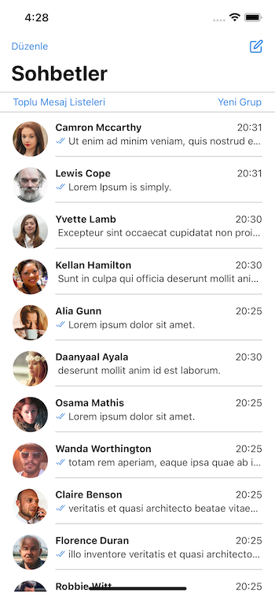
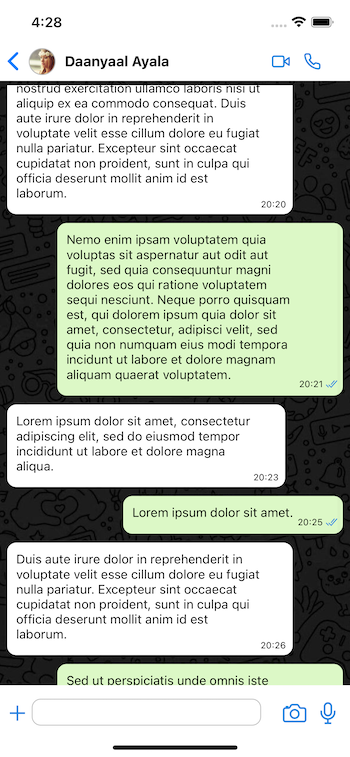

# React Native Whatsapp UI Clone

EN - This project is the second assignment within the scope of "Akbank React Native Bootcamp" organized by Patika.dev. It includes the interface design of the main screen and chat screen of the Whatsapp application.

TR - Bu proje Patika.dev 'in düzenlediği "Akbank React Native Bootcamp" kapsamında yapılan ikinci ödevdir. Whatsapp uygulamasının ana ekran ve chat ekranın arayüz tasarımını içermektedir.
  

## Screenshot APP

 
 

## Technologies

